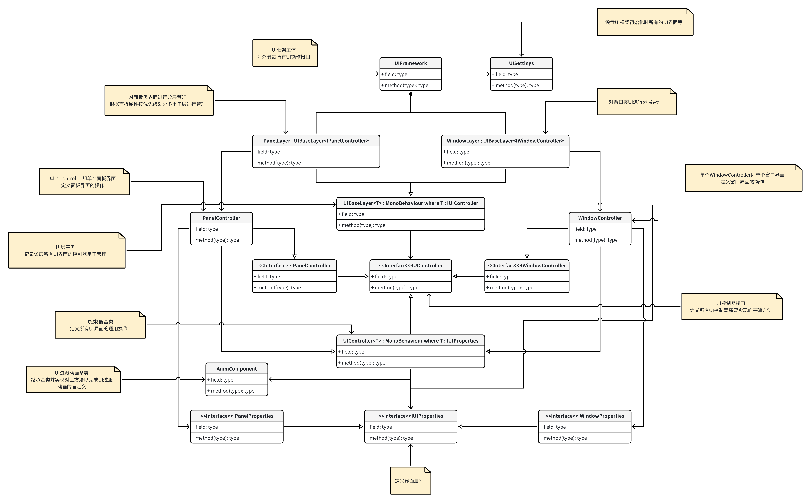

# UIFramework设计

## UIFramework类图

核心思想为分层管理各个UI界面，再用一个类管理所有层

单个层内存储所有需要管理的UI界面的Controller

使用Properties记录每个UI界面的属性，在显示UI界面时可以选择是否传入新的属性，用于替换原本UI界面上的如文本内容等信息

通过事件中心分发和捕获事件，进行对应的UI事件处理
## 使用方法
1. 创建一个新的类继承自 ASceneUIManager，作为某个场景的UI管理器，并在场景中设置一个位于Prefabs文件夹中的UIFramework预制体，将该脚本挂载到UIFramework上
```C#
    public class StartSceneUIManager : ASceneUIManager { }
```
2. 根据需要创建的UI类型，创建一个新类使其继承自PanelController或WindowController，并定义事件类型与UI界面额外属性
```C#
    /// <summary>
    /// 开始面板按下事件信号
    /// </summary>
    public class StartPanelPressDownSignal : ASignal{}

    /// <summary>
    /// 界面属性，可以通过实例化新的属性作为打开界面参数，以实现UI界面复用
    /// </summary>
    public class StartPanelProperties : PanelProperties
    {
        public string content;
        
        public StartPanelProperties(PanelPriority priority,string content) : base(priority)
        {
            this.content = content;
        }
    }
    
    /// <summary>
    /// 示例面板，继承PanelController额外添加自己的逻辑
    /// </summary>
    public class StartPanel : PanelController
    {
        public Text text;
        
        public void UI_OnMousePressDown()
        {
            Signals.Get<StartPanelPressDownSignal>().Dispatch();
        }

        protected override void SetProperties(IPanelProperties props)
        {
            if (props is StartPanelProperties startPanelProperties)
            {
                text.text = startPanelProperties.content;
            }
            base.SetProperties(props);
        }
    }
```
3. 将新类挂载到对象上并制作为预制体
4. 在最开始创建的类中设置新创建的UI预制体，添加事件处理
```C#
    /// <summary>
    /// StartScene示例UI管理器，管理当前场景的所有UI界面回调函数
    /// </summary>
    public class StartSceneUIManager : ASceneUIManager
    {
        protected override void AddSignal()
        {
            Signals.Get<StartPanelPressDownSignal>().AddListener(OnStartPanelPressDown);
        }

        protected override void RemoveSignal()
        {
            Signals.Get<StartPanelPressDownSignal>().RemoveListener(OnStartPanelPressDown);
        }
        
        #region 事件回调

        void OnStartPanelPressDown()
        {
            UIFrame.HideUI("StartPanel");
        }
        
        #endregion
    }
```
5. 运行即可显示UI界面